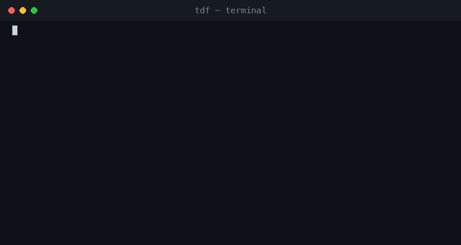

# TDF — Token-Dense Format

[](https://opensource.org/licenses/MIT)
[](https://www.python.org/downloads/)
[](https://github.com/meashumishra/TDF-Token-Dense-Format-/actions/workflows/ci.yml)

A document format and converter designed specifically for LLMs, with **100% distinct-content recall**. Savings scale with how structured the document is: **28–66%** below Markdown on table-heavy and boilerplate-heavy documents (PDFs, spreadsheets, HTML), dropping into the low teens on prose-heavy documents where Markdown was already near-optimal — see [Benchmarks](#benchmarks). It includes a *skeleton mode* to map documents for **~99% fewer tokens**, and robust parsing backed by property-based fuzzing.

```
pdf docx xlsx pptx html md csv txt  ──►  TDF  ──►  your LLM
```



## The Problem

Every LLM tool accepts document uploads. Under the hood, they convert the file to Markdown and paste it into the context window. That conversion is where the money and context window goes. Markdown was designed in 2004 for human readability, not token efficiency. 

Pipes in tables (`|`), repeating header cells, and standard formatting drastically inflate token counts. For table-heavy documents, formatting overhead is almost half the total token cost.

## Why TDF?

TDF solves this by introducing a line-oriented, token-optimized, plain-text format specifically engineered for BPE tokenizers.

* **100% Distinct-Content Recall:** Unlike prompt compression tools (like LLMLingua) that destructively discard entities and numbers, TDF's default mode achieves its compression through format optimization and dictionary coding. Every meaning-bearing term survives the round-trip.
* **Instant Conversion:** Runs instantly without requiring a GPU or a local LLM inference step.
* **Advanced Table Handling:** Borderless PDF table detection, rectangular grid enforcement, and columnar dictionary coding (Parquet/ORC concepts applied to LLM tokens).
* **Addressable Elision:** TDF can identify low-density structural boilerplate (like giant website nav trees) and replace it with a token-cheap `!E` marker. The LLM can retrieve the original if needed.
* **Strict Validation:** A formal grammar and validator guarantee TDF outputs are structurally perfect. Malformed inputs result in safe fallbacks, never data loss.

## Benchmarks

We measured TDF against standard Markdown, MarkItDown (Microsoft's standard converter), and LLMLingua (a popular prompt compression model). 

**Token Compression vs Markdown:**

| Document | TDF Saving vs MD | TDF Saving vs MarkItDown | Recall (Fidelity) |
|---|---|---|---|
| operating_review.pdf | **65.7%** | **65.7%** | 100.0% |
| services_agreement.docx | **47.0%** | **47.7%** | 100.0% |
| orders.csv | **45.8%** | **45.8%** | 100.0% |
| quarterly_deck.pptx | **37.3%** | **38.2%** | 100.0% |
| handbook.html | **43.8%** | **43.8%** | 100.0% |
| runbook.md | **27.8%** | **27.8%** | 100.0% |

These are structured/table-heavy documents, where TDF's gains are largest. On prose-heavy, out-of-training documents savings are smaller — `sec_filing.html` (42.8%), `kubernetes_docs.html` (22.9%), `attention.pdf` (13.3%) — because there's less table/boilerplate overhead for TDF to strip out and Markdown is already close to token-optimal for plain prose. Full numbers: [`bench/results_samples_real.md`](bench/results_samples_real.md).

**TDF vs LLMLingua (Content-Preserving vs Lossy):**

TDF's numbers below use `--no-legend` mode (the fairest match to LLMLingua's raw compressed output, which has no self-describing header either); with the default legend-on output, `handbook.html` saves 43.8% instead of 48.5% (see table above).

| Document | Markdown Tokens | TDF Tokens (Savings, no-legend) | LLMLingua Tokens (Savings) | LLMLingua CPU Time |
|---|---|---|---|---|
| sec_filing.html | 26,587 | 14,972 (43.7%) | 14,728 (44.6%) | 14.33s |
| handbook.html | 4,732 | 2,435 (48.5%) | 3,084 (34.8%) | 1.94s |

*LLMLingua destroys table structure, strips out rows randomly, merges columns, and drops critical values to achieve its compression. **TDF achieves similar or better compression (44-49%) natively during conversion with 100% distinct-content recall.***

## Installation

```bash
pip install tdf-converter
```

Or install from source:

```bash
git clone https://github.com/meashumishra/TDF-Token-Dense-Format-.git
cd TDF-Token-Dense-Format-
pip install .
```

## Usage

Use the CLI to convert your documents:

```bash
# Convert a document to TDF
tdf convert document.pdf --to tdf -o output.tdf

# Get a high-level summary skeleton (~99% smaller)
tdf convert large_report.docx --to skeleton

# Validate a TDF file against structural invariants
tdf validate output.tdf

# Print tokens and format stats for a file
tdf stats orders.csv
```

## How It Works

For a deep dive into the research, algorithmic decisions (Token-cost-weighted Re-Pair, Addressable Elision, Sentence Density tiering), and the exhaustive bug-hunting campaigns that hardened TDF, read the [Architecture & Research Notes](ARCHITECTURE.md).

## Known limitations

- **Small documents can come out larger, and it's not just prose.** `prose_only.pdf` is 222 Markdown tokens but 337 by default, because the ~130-token self-describing legend dominates (`--no-legend` brings it to 113). The same effect hits small tables: `borderless_report.pdf` and `ruled_report.pdf` (9x5 tables, ~530 Markdown tokens) are 1.7% *larger* than Markdown at default settings, but save 40%+ under `--no-legend`. `tdf stats` shows both numbers for a given file before you commit to one — below roughly 500 tokens, check it rather than assuming.
- **Scanned/image PDFs are not handled** — there is no OCR step. Pair with olmOCR or Chandra first.
- **Dictionary substitution hurts raw prose readability.** `...at the start of §3 1.` expands losslessly but reads badly to humans.
- **Fidelity metric is blind to word order.** "100% distinct-content recall" is a 'bag-of-words' metric. Reversing a sentence (e.g., "A > B" to "B > A") or swapping table columns still yields a 100% score despite destroying meaning.
- **Elision is intentionally lossy.** Addressable Elision (`!E`) deliberately drops content to shrink context; it does not preserve the original text.
- **LLM QA accuracy is insufficiently validated.** While TDF compresses structurally, we have not yet run an end-to-end LLM benchmark (e.g., GSM8K or RAG eval) to empirically prove that models can accurately reason over heavily compressed `!D` dictionaries without degradation.
- **Tokenizer assumptions:** We have verified compression consistency (44-72% savings on structured docs) across OpenAI's `o200k_base` and `cl100k_base` tokenizers, but it remains untested on SentencePiece or Llama tokenizers.

## License

MIT License. See [LICENSE](LICENSE) for details.
