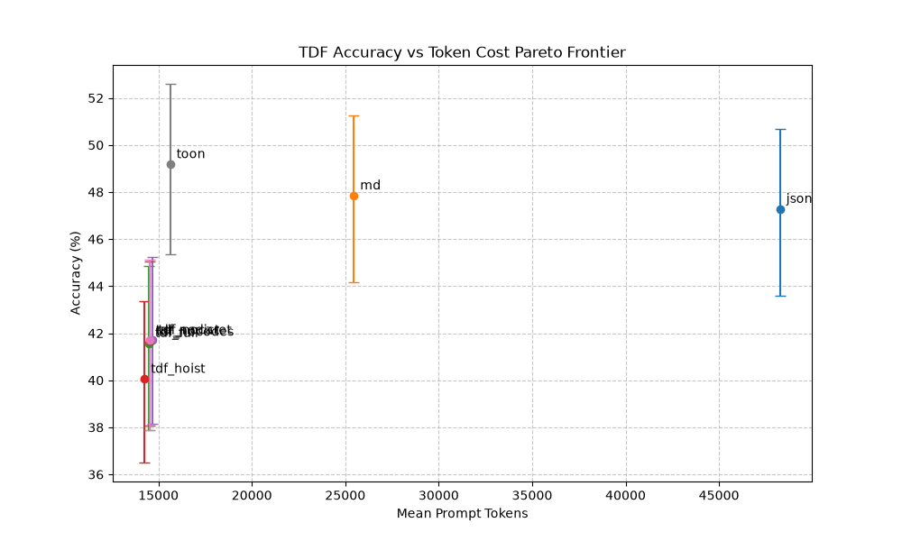

# TDF Accuracy-Per-Token Eval Report

*Generated 2026-08-24 from eval/results/raw.jsonl — real completions, no simulation.*

## 0. Provenance & completeness

- **Model:** openai/gpt-oss-120b (temperature 0.0, seeds 1-3)
- **Cells completed:** 6310/6312 (question x arm x seed). Every row is a real API response; responses are cached in eval/runner/.cache/ and replayed on re-run.
- 2 cell(s) could not be filled by the primary model (endpoint outage at fill time) — see the supplementary local-model fills below; paired analysis uses only primary-model triples.
- 2 row(s) completed by a supplementary local model and EXCLUDED from every headline statistic above/below to keep the corpus single-model: `local/Qwen/Qwen2.5-0.5B-Instruct` on sec_filing/md/seed2 (correct=False); `local/Qwen/Qwen2.5-0.5B-Instruct` on sec_filing/tdf_nocodes/seed3 (correct=False).
- **Corpus weighting caveat:** questions are not evenly distributed across documents (sec_filing: 86.3%, sales_report: 8.4%, co2_data: 2.3%, k8s_deployment: 1.5%, operating_review: 1.5%). Headline numbers are dominated by the largest contributor; read per-document breakdowns before generalising.

## 1. Pareto Scatter

## 2. Paired-Difference Table (Real)

| Arm | Mean Accuracy | vs MD | 95% CI |
|---|---|---|---|
| toon | 49.2% | +1.3pp | [-1.0, +3.8] |
| md | 47.8% | +0.0pp | [0.0, 0.0] |
| json | 47.3% | -0.6pp | [-2.9, +1.9] |
| tdf_nocaret | 41.7% | -6.1pp | [-8.8, -3.6] |
| tdf_nodict | 41.7% | -6.1pp | [-8.6, -3.6] |
| tdf_nocodes | 41.6% | -6.2pp | [-8.8, -3.6] |
| tdf_full | 41.6% | -6.3pp | [-8.8, -3.7] |
| tdf_hoist | 40.1% | -7.8pp | [-10.4, -5.2] |

## 3. Accuracy by Size Bucket

| Arm | Small (<=10k tok) | Medium (10-50k) | Large (>50k) |
|---|---|---|---|
| json | 50.0% | 45.7% | 95.8% |
| md | 50.0% | 47.8% | 0.0% |
| tdf_full | 41.7% | 40.6% | 83.3% |
| tdf_hoist | 16.7% | 39.4% | 83.3% |
| tdf_nocaret | 41.7% | 41.0% | 72.2% |
| tdf_nocodes | 41.7% | 40.6% | 83.3% |
| tdf_nodict | 50.0% | 40.6% | 83.3% |
| toon | 33.3% | 48.4% | 94.4% |

*Buckets are assigned per-prompt by token count, so arms can see different documents inside one bucket (e.g. the >50k bucket contains no markdown rows at all). Descriptive only -- not a controlled size-effect comparison.*

## 4. Accuracy by Question Type (Real)

| Arm | column_association | cross_reference | deref_code | deref_dict | exact_identifier | multi_hop_table | negation | numeric_comparison | ordering | repeated_cell | row_association |
|---|---|---|---|---|---|---|---|---|---|---|---|
| json | 96.7% | 0.0% | 66.7% | 33.3% | 50.0% | 44.4% | 16.1% | 6.5% | 4.7% | 91.7% | 72.7% |
| md | 99.3% | 50.0% | 66.7% | 33.3% | 33.3% | 33.3% | 18.6% | 5.6% | 7.3% | 86.7% | 74.0% |
| tdf_full | 94.7% | 0.0% | 55.6% | 66.7% | 0.0% | 20.0% | 29.9% | 7.4% | 4.7% | 80.0% | 50.0% |
| tdf_hoist | 98.0% | 0.0% | 33.3% | 33.3% | 16.7% | 20.0% | 21.8% | 8.3% | 4.0% | 78.3% | 46.7% |
| tdf_nocaret | 95.3% | 0.0% | 55.6% | 66.7% | 0.0% | 20.0% | 29.9% | 7.4% | 4.7% | 81.7% | 49.3% |
| tdf_nocodes | 100.0% | 0.0% | 66.7% | 66.7% | 0.0% | 20.0% | 27.6% | 6.5% | 4.0% | 75.0% | 49.3% |
| tdf_nodict | 94.7% | 0.0% | 55.6% | 33.3% | 41.7% | 20.0% | 29.9% | 7.4% | 4.7% | 80.0% | 50.0% |
| toon | 97.3% | 33.3% | 66.7% | 25.0% | 16.7% | 44.4% | 29.9% | 7.4% | 4.7% | 83.3% | 78.7% |

## 5. Ablation Ladder (Real)

| Config | Tokens | Accuracy | Impact |
|---|---|---|---|
| tdf_full | 14486 | 41.6% | Baseline |
| tdf_nodict | 14530 | 41.7% | +0.1pp |
| tdf_nocodes | 14543 | 41.6% | +0.1pp |
| tdf_nocaret | 14667 | 41.7% | +0.1pp |

## 6. Elision Track

Elision requires a multi-turn protocol (model must request omitted regions). This report excludes elision accuracy until that protocol runner is added.

## 7. Decision (applied per eval/PREREGISTRATION.md)

TDF full vs Markdown: delta=-6.3pp, 95% CI [-8.8, -3.7] (paired bootstrap over 788 matched doc/question/seed triples).

**Verdict:** **Marginal.** Per the pre-registered rule: ship only the hybrid emitter (Markdown for prose, TDF for tables) and re-test.

Mean prompt tokens: markdown 25,461 vs tdf_full 14,486 (43.1% fewer).

- Ablation `tdf_nodict`: +0.1pp vs tdf_full.
- Ablation `tdf_nocodes`: +0.1pp vs tdf_full.
- Ablation `tdf_nocaret`: +0.1pp vs tdf_full.
- No ablation recovers >=3pp; no mechanism is disabled.